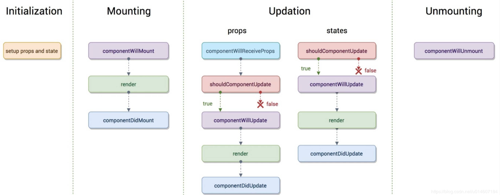

*react*

## react生命周期废弃了哪几个? diff算法？ 与vue区别？
### react生命周期
- [生命周期详解](https://juejin.im/post/6844903808489750541)

- v16.3之前的生命周期图谱：

- v16.3之后的生命周期图谱：


### 部分生命周期函数被弃用的原因(componentWillMount，componentWillReceiveProps，componentWillUpdate)
- https://juejin.im/post/6844904021233238024
- https://juejin.im/post/6844903679418433550


## 性能优化
- https://juejin.im/post/6844903985338400782

### 减少渲染次数
- 类组件：可以使用 pureComponent；
- 函数组件：使用 React.memo(高阶组件) ，将函数组件传递给 memo 之后，就会返回一个新的组件，新组件的功能：如果接受到的属性不变，则不重新渲染函数；
- React.PureComponent 的 shouldComponentUpdate() 仅对对象进行浅比较。 如果这些包含复杂的数据结构，它可能会在更深层数据差异比较时发生判断偏差。 所以扩展 PureComponent 只能用于具有简单 props 和 state 的组件，或者在知道深层数据结构已更改时使用forceUpdate() 来强制更新的组件。 或者，考虑使用不可变对象来帮助嵌套数据的快速比较。


## hooks
- useCallback：接收一个内联回调函数参数和一个依赖项数组（子组件依赖父组件的状态，即子组件会使用到父组件的值） ，useCallback 会返回回调函数的 memoized 版本，该回调函数仅在某个依赖项改变时才会更新.
- useMemo：把创建函数和依赖项数组作为参数传入 useMemo，它仅会在某个依赖项改变时才重新计算 memoized 值。这种优化有助于避免在每次渲染时都进行高开销的计算.

### useState
- useState 唯一的参数就是初始 state
- useState 会返回一个数组：一个 state，一个更新 state 的函数
    - 在初始化渲染期间，返回的状态 (state) 与传入的第一个参数 (initialState) 值相同
    - 你可以在事件处理函数中或其他一些地方调用这个函数。它类似 class 组件的 this.setState，但是它不会把新的 state 和旧的 state 进行合并，而是直接替换

### forwardRef (hooks再父子通信时会用到)
- 因为函数组件没有实例，所以函数组件无法像类组件一样可以接收 ref 属性
- forwardRef 可以在父组件中操作子组件的 ref 对象
- forwardRef 可以将父组件中的 ref 对象转发到子组件中的 dom 元素上
- 子组件接受 props 和 ref 作为参数

```javascript
const Child = React.forwardRef((props,ref) => {
  return (
    <input type="text" ref={ref}/>
  )
});

function Parent(){
  let [number,setNumber] = useState(0); 
  // 在使用类组件的时候，创建 ref 返回一个对象，该对象的 current 属性值为空
  // 只有当它被赋给某个元素的 ref 属性时，才会有值
  // 所以父组件（类组件）创建一个 ref 对象，然后传递给子组件（类组件），子组件内部有元素使用了
  // 那么父组件就可以操作子组件中的某个元素
  // 但是函数组件无法接收 ref 属性 <Child ref={xxx} /> 这样是不行的
  // 所以就需要用到 forwardRef 进行转发
  const inputRef = useRef();//{current:''}
  function getFocus(){
    inputRef.current.value = 'focus';
    inputRef.current.focus();
  }
  return (
      <>
        <Child ref={inputRef}/>
        <button onClick={()=>setNumber({number:number+1})}>+</button>
        <button onClick={getFocus}>获得焦点</button>
      </>
  )
}
```

### useImperativeHandle (可以让你在使用 ref 时，自定义暴露给父组件的实例值，不能让父组件想干嘛就干嘛)
- 在大多数情况下，应当避免使用 ref 这样的命令式代码。useImperativeHandle 应当与 forwardRef 一起使用
- 父组件可以使用操作子组件中的多个 ref

```
import React,{useState,useEffect,createRef,useRef,forwardRef,useImperativeHandle} from 'react';

const Child = forwardRef((props,parentRef) => {
    // 子组件内部自己创建 ref 
    let focusRef = useRef();
    let inputRef = useRef();
    useImperativeHandle(parentRef,()=>(
      // 这个函数会返回一个对象
      // 该对象会作为父组件 current 属性的值
      // 通过这种方式，父组件可以使用操作子组件中的多个 ref
        return {
            focusRef,
            inputRef,
            name:'计数器',
            focus(){
                focusRef.current.focus();
            },
            changeText(text){
                inputRef.current.value = text;
            }
        }
    });
    return (
        <>
            <input ref={focusRef}/>
            <input ref={inputRef}/>
        </>
    )
})

function Parent(){
  const parentRef = useRef();//{current:''}
  function getFocus(){
    parentRef.current.focus();
    // 因为子组件中没有定义这个属性，实现了保护，所以这里的代码无效
    parentRef.current.addNumber(666);
    parentRef.current.changeText('<script>alert(1)</script>');
    console.log(parentRef.current.name);
  }
  return (
      <>
        <ForwardChild ref={parentRef}/>
        <button onClick={getFocus}>获得焦点</button>
      </>
  )
}
```

### 自定义 Hook
- 自定义 Hook 更像是一种约定，而不是一种功能。如果函数的名字以 use 开头，并且调用了其他的 Hook，则就称其为一个自定义 Hook
- 有时候我们会想要在组件之间重用一些状态逻辑，之前要么用 render props ，要么用高阶组件，要么使用 redux
- 自定义 Hook 可以让你在不增加组件的情况下达到同样的目的
- Hook 是一种复用状态逻辑的方式，它不复用 state 本身
- 事实上 Hook 的每次调用都有一个完全独立的 state

```
import React, { useLayoutEffect, useEffect, useState } from 'react';
import ReactDOM from 'react-dom';

function useNumber(){
  let [number,setNumber] = useState(0);
  useEffect(()=>{
    setInterval(()=>{
        setNumber(number=>number+1);
    },1000);
  },[]);
  return [number,setNumber];
}

// 每个组件调用同一个 hook，只是复用 hook 的状态逻辑，并不会共用一个状态
function Counter1(){
    let [number,setNumber] = useNumber();
    return (
        <div><button onClick={()=>{
            setNumber(number+1)
        }}>{number}</button></div>
    )
}

function Counter2(){
    let [number,setNumber] = useNumber();
    return (
        <div><button  onClick={()=>{
            setNumber(number+1)
        }}>{number}</button></div>
    )
}

ReactDOM.render(<><Counter1 /><Counter2 /></>, document.getElementById('root'));
```