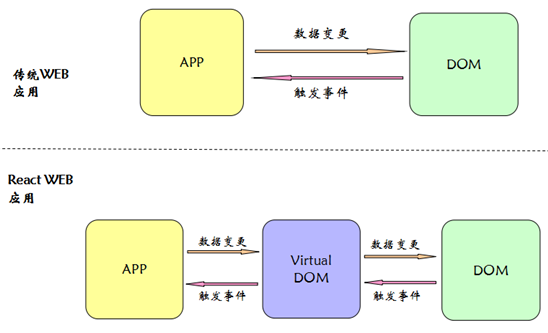
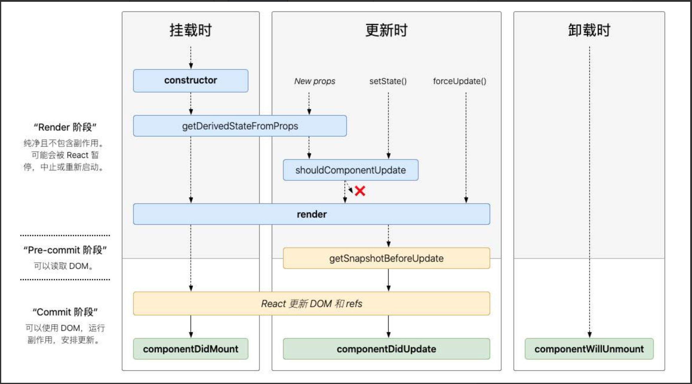

# react

## react 虚拟dom（virtual dom）
- 本质上是 JavaScript 对象，这个对象就是更加轻量级的对 DOM 的描述。
- React是这么干的：你给我一个数据，我根据这个数据生成一个全新的Virtual DOM，然后跟我上一次生成的Virtual DOM去 diff，得到一个Patch，然后把这个Patch打到浏览器的DOM上去。完事。并且这里的patch显然不是完整的虚拟DOM，而是新的虚拟DOM和上一次的虚拟DOM经过diff后的差异化的部分。

- 图谱：


- 资料
    - [深入分析虚拟DOM的渲染原理和特性](https://segmentfault.com/a/1190000018891454)
    - [深入理解react中的虚拟DOM、diff算法](https://www.cnblogs.com/zhuzhenwei918/p/7271305.html)


## react 事件机制
- [React事件机制](https://segmentfault.com/a/1190000018391074)


## react生命周期废弃了哪几个? 与vue区别？
### react生命周期
- [生命周期详解](https://juejin.im/post/6844903808489750541)

- v16.3之前的生命周期图谱：

- v16.3之后的生命周期图谱：


### 生命周期钩子详解
- getDerivedStateFromProps
    - **getDerivedStateFromProps**本来（React v16.3中）是只在创建和更新（由父组件引发部分）中调用。如果不是由父组件引发，那么getDerivedStateFromProps也不会被调用，如自身setState引发或者forceUpdate引发。
    
- getSnapshotBeforeUpdat
    - **getSnapshotBeforeUpdate()** 被调用于render之后，可以读取但无法使用DOM的时候。它使您的组件可以在可能更改之前从DOM捕获一些信息（例如滚动位置）。此生命周期返回的任何值都将作为参数传递给componentDidUpdate（）。
```javascript
class ScrollingList extends React.Component {
  constructor(props) {
    super(props);
    this.listRef = React.createRef();
  }

  getSnapshotBeforeUpdate(prevProps, prevState) {
    //我们是否要添加新的 items 到列表?
    // 捕捉滚动位置，以便我们可以稍后调整滚动.
    if (prevProps.list.length < this.props.list.length) {
      const list = this.listRef.current;
      return list.scrollHeight - list.scrollTop;
    }
    return null;
  }

  componentDidUpdate(prevProps, prevState, snapshot) {
    //如果我们有snapshot值, 我们已经添加了 新的items.
    // 调整滚动以至于这些新的items 不会将旧items推出视图。
    // (这边的snapshot是 getSnapshotBeforeUpdate方法的返回值)
    if (snapshot !== null) {
      const list = this.listRef.current;
      list.scrollTop = list.scrollHeight - snapshot;
    }
  }

  render() {
    return (
      <div ref={this.listRef}>{/* ...contents... */}</div>
    );
  }
}
```


### 部分生命周期函数被弃用的原因(componentWillMount，componentWillReceiveProps，componentWillUpdate)
- [你真的了解 React 生命周期吗](https://juejin.im/post/6844904021233238024)
- [聊聊React v16.3的UNSAFE类生命周期](https://juejin.im/post/6844903679418433550)

- 原因：
    - React 17.0 版本： 推出新的渲染方式——异步渲染（ Async Rendering），提出一种可被打断的生命周期，而可以被打断的阶段正是实际 dom 挂载之前的虚拟 dom 构建阶段，也就是要被去掉的三个生命周期 componentWillMount，componentWillReceiveProps 和 componentWillUpdate。


## react 中的 setState为什么异步？能不能同步？什么时候异步？什么时候同步？
- setState只在合成事件和钩子函数中是“异步”的，在原生事件和setTimeout 中都是同步的。

- 原因：
    - 在React的setState函数实现中，会根据一个变量isBatchingUpdates判断是直接更新this.state还是放到队列中回头再说，而isBatchingUpdates默认是false，也就表示setState会同步更新this.state，但是，有一个函数batchedUpdates，这个函数会把isBatchingUpdates修改为true，而当React在调用事件处理函数之前就会调用这个batchedUpdates，造成的后果，就是由React控制的事件处理过程setState不会同步更新this.state 。
    - 对于异步渲染，我们应在 getSnapshotBeforeUpdate 中读取 state、props, 而不是 componentWillUpdate。但调用forceUpdate() 强制 render 时，会导致组件跳过 shouldComponentUpdate(),直接调用 render()。

- 注意： 
    - setState的“异步”并不是说内部由异步代码实现，其实本身执行的过程和代码都是同步的，只是合成事件和钩子函数的调用顺序在更新之前，导致在合成事件和钩子函数中没法立马拿到更新后的值，形式了所谓的“异步”，当然可以通过第二个参数 setState(partialState, callback) 中的callback拿到更新后的结果。
    - setState 的批量更新优化也是建立在“异步”（合成事件、钩子函数）之上的，在原生事件和setTimeout 中不会批量更新，在“异步”中如果对同一个值进行多次setState，setState的批量更新策略会对其进行覆盖，取最后一次的执行，如果是同时setState多个不同的值，在更新时会对其进行合并批量更新。

- 例子：
```javascript
class Example extends React.Component {
  constructor() {
    super();
    this.state = {
      val: 0
    };
  }
  
  componentDidMount() {
    this.setState({val: this.state.val + 1});
    console.log(this.state.val);    // 第 1 次 log

    this.setState({val: this.state.val + 1});
    console.log(this.state.val);    // 第 2 次 log

    setTimeout(() => {
      this.setState({val: this.state.val + 1});
      console.log(this.state.val);  // 第 3 次 log

      this.setState({val: this.state.val + 1});
      console.log(this.state.val);  // 第 4 次 log
    }, 0);
  }

  render() {
    return null;
  }

  // 0 0 2 3
};
```

- 资料：
    - [setState原理](https://juejin.im/post/6844903718219956232)
    - [深入setState机制](https://github.com/sisterAn/blog/issues/26)


## react 组件懒加载
- [延迟加载](https://juejin.im/post/6844903778928476174)
- [react-loadable原理浅析](https://juejin.im/post/6844903560325398541)

### react-loadable(react npm 库， < v16.6.0)
```javascript
import {loadable} from '@loadable/component';
import * as React from 'react';

export const LazyDemo = loadable(
    () => import('./demo'),
);
```

### 通过react lazy 和 Suspense ( > v16.6.0 )
- 组件中
```javascript
import React, {lazy, Suspense} from 'react';
const OtherComponent = lazy(() => import('./OtherComponent'));

function MyComponent() {
  return (
    <Suspense fallback={<div>Loading...</div>}>
      <OtherComponent />
    </Suspense>
  );
}
```

- 路由
```javascript
import { BrowserRouter as Router, Route, Switch } from 'react-router-dom';
import React, { Suspense, lazy } from 'react';

const Home = lazy(() => import('./routes/Home'));
const UserManage = lazy(() => import('./routes/UserManage'));
const AssetManage = lazy(() => import('./routes/AssetManage'));
const AttendanceManage = lazy(() => import('./routes/AttendanceManage'));

const App = () => (
  <Router>
    <Suspense fallback={<div>Loading...</div>}>
      <Switch>
        <Route exact path="/" component={Home}/>
        <Route path="/userManage" component={UserManage}/>
        <Route path="/assetManage" component={AssetManage}/>
        <Route path="/attendanceManage" component={AttendanceManage}/>
      </Switch>
    </Suspense>
  </Router>
)
```

- require.ensure() (已经不建议使用)
```javascript
{
    path: 'handover-contract-apply',
    getComponent(location, callback) {
        require.ensure([], () => callback(null, require('./HandoverPage/ApplyManage').default));
    }
}
```


## 性能优化
### 避免调停
- [避免调停](https://juejin.im/post/6846687604130185230)
1. react 组件中 不要在render中绑定方法this, 直接在构造函数中绑定this
```javascript
constructor(props) {
    super(props)
    this.handleClick = this.handleClick.bind(this)
}
handleClick() {
    console.log('点击')
}
render() {
    return (
        <div>
            // 第一种，构造函数每一次渲染的时候只会执行一遍；(最好)
            <button onclick={this.handleClick}></button>

            // 第二种方法，在每次render()的时候都会重新执行一遍函数；
            <button onclick={this.handleClick.bind(this)}></button>

            // 第三种方法的话，每一次render()的时候，都会生成一个新的箭头函数，即使两个箭头函数的内容是一样的。
            <button onclick={() => this.handleClick()}></button>
        </div>
    )
}
```

2. 当一个组件的 props 或 state 变更，React 会将最新返回的元素与之前渲染的元素进行对比，以此决定是否有必要更新真实的 DOM。当它们不相同时，React 会更新该 DOM。
- 即使 React 只更新改变了的 DOM 节点，重新渲染仍然花费了一些时间。在大部分情况下它并不是问题，不过如果它已经慢到让人注意了，你可以通过覆盖生命周期方法 shouldComponentUpdate 来进行提速。该方法会在重新渲染前被触发。其默认实现总是返回 true，让 React 执行更新：
```javascript
shouldComponentUpdate(nextProps, nextState) {
 // 进行比较判断是否更新
  return true;
}

<!--在大部分情况下，你可以继承 React.PureComponent 以代替手写 shouldComponentUpdate()。它用当前与之前 props 和 state 的浅比较覆写了 shouldComponentUpdate() 的实现。-->
```

3. 设置列表的唯一的key


### 虚拟化长列表
- [长列表优化之虚拟列表](https://juejin.im/post/6844903893441183751)
- 如果你的应用渲染了长列表（上百甚至上千的数据），我们推荐使用“虚拟滚动”技术。这项技术会在有限的时间内仅渲染有限的内容，并奇迹般地降低重新渲染组件消耗的时间，以及创建 DOM 节点的数量。
- react-window 和 react-virtualized 是热门的虚拟滚动库。 它们提供了多种可复用的组件，用于展示列表、网格和表格数据。 如果你想要一些针对你的应用做定制优化，你也可以创建你自己的虚拟滚动组件，就像 Twitter 所做的。


### 减少渲染次数
- 类组件：可以使用 pureComponent；
- 函数组件：使用 React.memo(高阶组件) ，将函数组件传递给 memo 之后，就会返回一个新的组件，新组件的功能：如果接受到的属性不变，则不重新渲染函数；
- React.PureComponent 的 shouldComponentUpdate() 仅对对象进行浅比较。 如果这些包含复杂的数据结构，它可能会在更深层数据差异比较时发生判断偏差。 所以扩展 PureComponent 只能用于具有简单 props 和 state 的组件，或者在知道深层数据结构已更改时使用forceUpdate() 来强制更新的组件。 或者，考虑使用不可变对象来帮助嵌套数据的快速比较。


## hooks
- useCallback：接收一个内联回调函数参数和一个依赖项数组（子组件依赖父组件的状态，即子组件会使用到父组件的值） ，useCallback 会返回回调函数的 memoized 版本，该回调函数仅在某个依赖项改变时才会更新.
- useMemo：把创建函数和依赖项数组作为参数传入 useMemo，它仅会在某个依赖项改变时才重新计算 memoized 值。这种优化有助于避免在每次渲染时都进行高开销的计算.


### useState
- useState 唯一的参数就是初始 state
- useState 会返回一个数组：一个 state，一个更新 state 的函数
    - 在初始化渲染期间，返回的状态 (state) 与传入的第一个参数 (initialState) 值相同
    - 你可以在事件处理函数中或其他一些地方调用这个函数。它类似 class 组件的 this.setState，但是它不会把新的 state 和旧的 state 进行合并，而是直接替换


### useCallback
- 缓存回调函数，避免传入的回调每次都是新的函数实例而导致依赖组件重新渲染，具有性能优化的效果；


### useMemo
- 用于缓存传入的 props，避免依赖的组件每次都重新渲染；


### useRef
- 获取组件的真实节点


### forwardRef (hooks 在父子通信时会用到)
- 因为函数组件没有实例，所以函数组件无法像类组件一样可以接收 ref 属性
- forwardRef 可以在父组件中操作子组件的 ref 对象
- forwardRef 可以将父组件中的 ref 对象转发到子组件中的 dom 元素上
- 子组件接受 props 和 ref 作为参数

```javascript
const Child = React.forwardRef((props,ref) => {
  return (
    <input type="text" ref={ref}/>
  )
});

function Parent(){
  let [number,setNumber] = useState(0); 
  // 在使用类组件的时候，创建 ref 返回一个对象，该对象的 current 属性值为空
  // 只有当它被赋给某个元素的 ref 属性时，才会有值
  // 所以父组件（类组件）创建一个 ref 对象，然后传递给子组件（类组件），子组件内部有元素使用了
  // 那么父组件就可以操作子组件中的某个元素
  // 但是函数组件无法接收 ref 属性 <Child ref={xxx} /> 这样是不行的
  // 所以就需要用到 forwardRef 进行转发
  const inputRef = useRef();//{current:''}
  function getFocus(){
    inputRef.current.value = 'focus';
    inputRef.current.focus();
  }
  return (
      <>
        <Child ref={inputRef}/>
        <button onClick={()=>setNumber({number:number+1})}>+</button>
        <button onClick={getFocus}>获得焦点</button>
      </>
  )
}
```

### useImperativeHandle (可以让你在使用 ref 时，自定义暴露给父组件的实例值，不能让父组件想干嘛就干嘛)
- 在大多数情况下，应当避免使用 ref 这样的命令式代码。useImperativeHandle 应当与 forwardRef 一起使用
- 父组件可以使用操作子组件中的多个 ref

```javascript
import React,{useState,useEffect,createRef,useRef,forwardRef,useImperativeHandle} from 'react';

const Child = forwardRef((props,parentRef) => {
    // 子组件内部自己创建 ref 
    let focusRef = useRef();
    let inputRef = useRef();
    useImperativeHandle(parentRef,()=>(
      // 这个函数会返回一个对象
      // 该对象会作为父组件 current 属性的值
      // 通过这种方式，父组件可以使用操作子组件中的多个 ref
        return {
            focusRef,
            inputRef,
            name:'计数器',
            focus(){
                focusRef.current.focus();
            },
            changeText(text){
                inputRef.current.value = text;
            }
        }
    });
    return (
        <>
            <input ref={focusRef}/>
            <input ref={inputRef}/>
        </>
    )
})

function Parent(){
  const parentRef = useRef();//{current:''}
  function getFocus(){
    parentRef.current.focus();
    // 因为子组件中没有定义这个属性，实现了保护，所以这里的代码无效
    parentRef.current.addNumber(666);
    parentRef.current.changeText('<script>alert(1)</script>');
    console.log(parentRef.current.name);
  }
  return (
      <>
        <ForwardChild ref={parentRef}/>
        <button onClick={getFocus}>获得焦点</button>
      </>
  )
}
```

### 自定义 Hook
- 自定义 Hook 更像是一种约定，而不是一种功能。如果函数的名字以 use 开头，并且调用了其他的 Hook，则就称其为一个自定义 Hook
- 有时候我们会想要在组件之间重用一些状态逻辑，之前要么用 render props ，要么用高阶组件，要么使用 redux
- 自定义 Hook 可以让你在不增加组件的情况下达到同样的目的
- Hook 是一种复用状态逻辑的方式，它不复用 state 本身
- 事实上 Hook 的每次调用都有一个完全独立的 state

```javascript
import React, { useLayoutEffect, useEffect, useState } from 'react';
import ReactDOM from 'react-dom';

function useNumber(){
  let [number,setNumber] = useState(0);
  useEffect(()=>{
    setInterval(()=>{
        setNumber(number=>number+1);
    },1000);
  },[]);
  return [number,setNumber];
}

// 每个组件调用同一个 hook，只是复用 hook 的状态逻辑，并不会共用一个状态
function Counter1(){
    let [number,setNumber] = useNumber();
    return (
        <div><button onClick={()=>{
            setNumber(number+1)
        }}>{number}</button></div>
    )
}

function Counter2(){
    let [number,setNumber] = useNumber();
    return (
        <div><button  onClick={()=>{
            setNumber(number+1)
        }}>{number}</button></div>
    )
}

ReactDOM.render(<><Counter1 /><Counter2 /></>, document.getElementById('root'));
```


### 性能优化
- 钩子函数必须增加依赖项，以减少没必要的重复渲染。


##  HOC(高阶组件)
- 简述:
    - 高阶组件不是组件，是 增强函数，可以输入一个元组件，返回出一个新的增强组件；
    - 高阶组件的主要作用是 代码复用，操作 状态和参数；

- 例子：
```javascript
function proxyHoc(Comp) {
 	return class extends React.Component {
 		render() {
 			const newProps = {
 				name: 'tayde',
 				age: 1,
 			}
 			return <Comp {...this.props} {...newProps} />
 		}
 	}
 }
```

- 缺点：
    - 首先是被包裹组件的静态方法会消失，这其实也是很好理解的，我们将组件当做参数传入函数中，返回的已经不是原来的组件，而是一个新的组件，原来的静态方法自然就不存在了。如果需要保留，我们可以手动将原组件的方法拷贝给新的组件，或者使用hoist-non-react-statics之类的库来进行拷贝。